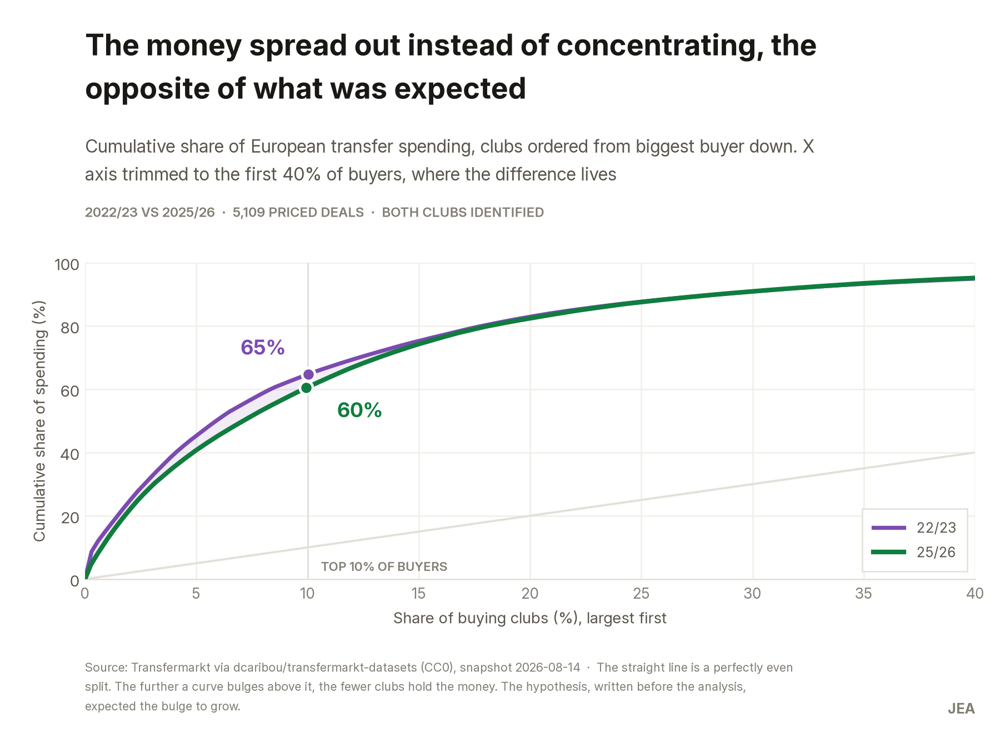
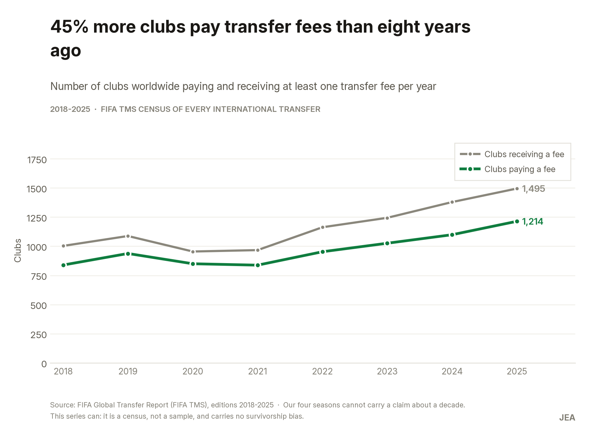
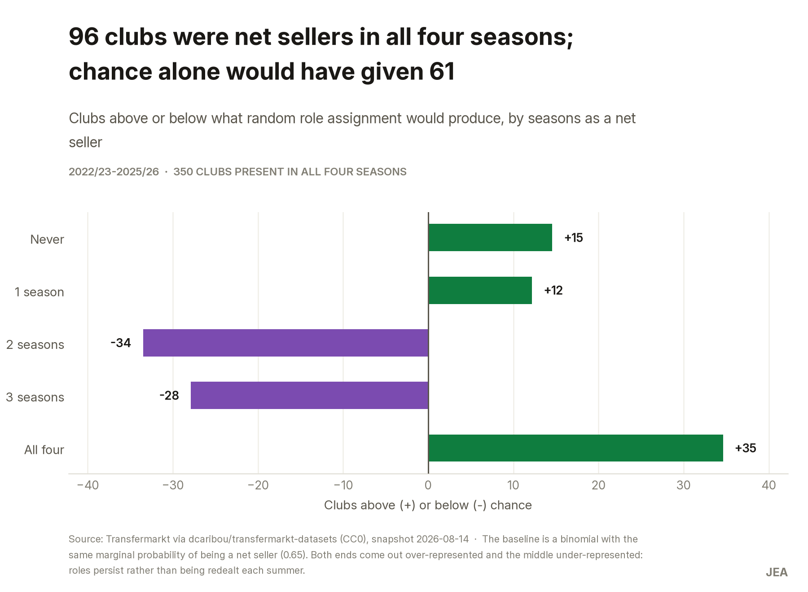
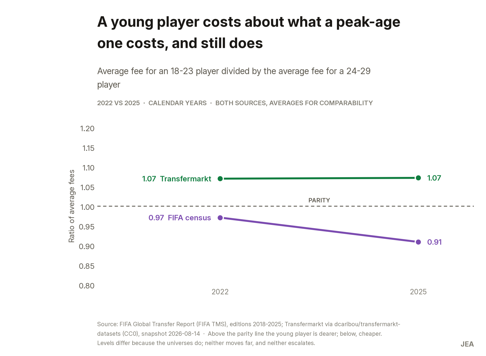
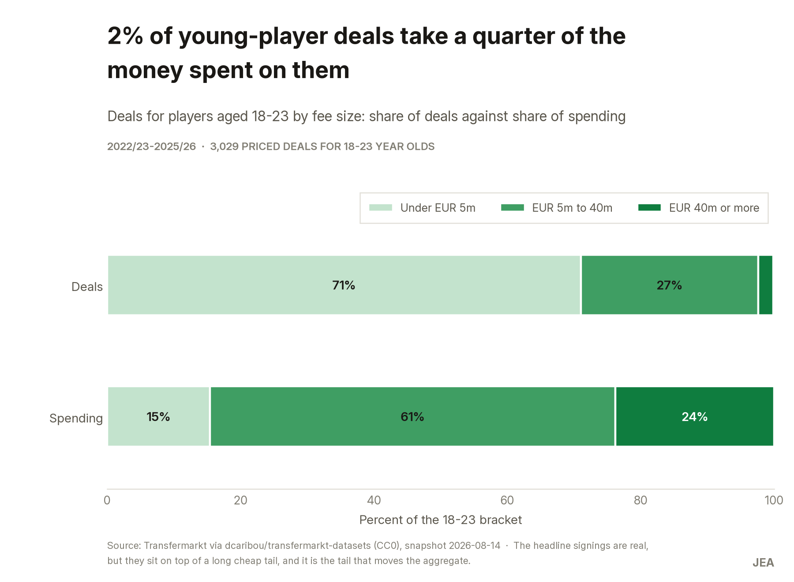

## Context

A multi-club investment fund has to decide where its next tranche of capital goes: into a club that
develops and sells players, or into an elite one that buys them. The answer turns on two beliefs
the industry treats as settled — that transfer spending is concentrating in fewer hands, and that
young players now command a growing premium. Between them they decide whether "develop and sell"
still carries a margin.

The analytical question: **across the European transfer market, and over the four windows from
2022/23 to 2025/26, is spending concentrating on fewer buying clubs, and is a larger share of it
going to players under 24?**

I wrote the expected answer down before opening the data — the gap widening, the youth premium
outgrowing the market — because a hypothesis recorded afterwards is not a hypothesis. The analysis
contradicted it on both counts.

*The client is fictional. The analysis is not.*

## Data

Two sources doing two different jobs, **never joined at record level**.

| Source | Job | Period | Licence |
|---|---|---|---|
| FIFA Global Transfer Report (FIFA TMS) | The decade series and the age axis | 2016–2025 market · 2018–2025 by age | FIFA publication; figures transcribed with citation, PDFs not redistributed |
| `dcaribou/transfermarkt-datasets` | Deal-level detail: clubs, players, fees | 22/23–25/26 | CC0-1.0 |

FIFA's report is the official **census** of international transfers — every one has to pass through
the system that produces it — so it carries no survivorship bias but never names a club.
Transfermarkt names every club and player, which is what makes a buyer/seller gap computable at
all, but it is a scrape and its coverage is uneven.

**The limitation that shaped the whole design.** Transfermarkt rebuilds each player's history from
the players present in its base *today*. Coverage therefore thins going backwards — and it thins
**differentially by age**: the mean age of priced deals drifts from 20.8 to 24.4 and the share
aged 18–21 falls from 53.8% to 21.2% between 2010/11 and 2025/26. None of that is football; it is
who survives in the database. Taken at face value, this source answers the *opposite* of the
hypothesis for reasons unrelated to the sport.

The series stabilises from 22/23 onwards, so deal-level analysis uses only those four seasons, and
every claim about a decade comes from the census instead.

Also declared, because they bound what can be said: no claim is made about the level or direction
of youth spending share — the two sources disagree and the gap doubles in 2025 without an
explanation I can defend. Under-18s are not analysable at 2–7 priced deals a season. Nothing here
is causal. And net transfer income is not profit: without club accounts, "sells well" is not the
same as "makes money".

## Process

SQL on DuckDB: four tables to join, a window to select, a categorisation to apply, and a rebuild
that needs no server and no cloud account. The queries live as real `.sql` files rather than inside
Python strings, so they can be read and judged on their own; Python only orchestrates them and
draws the figures.

Nothing in the raw data needed correcting — no duplicates, no impossible ages, no club transferring
to itself, no club under two identifiers. Every transformation is a *selection*, not a repair, and
the checks that came back empty are recorded anyway: an unrecorded check is indistinguishable from
a check never run.

Three decisions did have to be made. Only rows with a fee above zero carry price information,
because upstream the parser collapses loans, free transfers and unrecorded fees to zero or null
without distinction. Club coverage is partial and **not at random**, so the analysis runs on two
declared universes — one for price and age metrics that keeps the cheap purchases of young talent
from outside the covered leagues, another for club-level metrics where both parties must be known.
And DuckDB compares strings case-sensitively, which would have silently emptied the European filter
had it gone unchecked.

The pipeline reconciles its own row counts and fails loudly if the result stops matching what the
previous phase closed with. A pipeline that finishes without complaining is not the same as a
pipeline that is correct.

## Findings

### The money is spreading out, not concentrating

The ten largest buying clubs took 32.1% of European transfer spending in 2022/23 and 26.7% in
2025/26, while the number of clubs buying at all rose from 339 to 382.



It is not an English phenomenon: excluding English buyers the top-10 share still falls, from 30.6%
to 24.0%. And it is not a four-season blip — FIFA's census shows 45% more clubs paying transfer
fees in 2025 than in 2018, and 49% more receiving them.



### Selling is a position, not a bad year

Of the 350 clubs present in all four seasons, 202 were net sellers in three or more, and 96 in all
four. If the role were dealt at random with the same overall frequency, 61 clubs would land in that
last group — and 5 would never sell, against the 20 observed. Both tails are over-represented, so
the roles persist rather than rotating each summer.



The measure names them. Ajax banked €267m net across the four seasons, Salzburg €234m, Lille €185m.
Chelsea (−€800m), Manchester United (−€672m) and Arsenal (−€637m) never once finished a season as
net sellers.

### Youth carries no premium

An 18–23 player costs about what a 24–29 player costs, and that ratio does not escalate in either
source over the period measured.



The levels differ because the universes do — FIFA counts only international transfers, this dataset
also counts domestic ones — but neither series rises. An earlier reading of mine said the ratio was
*falling*; it appeared only when cutting the data by season and hung on a single starting
observation, so it did not survive checking against other specifications and was withdrawn. What
the evidence carries is parity and no escalation, and that is what is published.

### But the young market runs at two speeds

Inside the 18–23 bracket, deals of €40m or more are 2.3% of transactions and take 23.8% of
everything spent on the bracket, while the 71% priced under €5m account for 15%.



The headline signings are real and concentrated — Chelsea alone spent €688m across ten such deals,
Liverpool €462m, PSG €430m, and seven of the top ten buyers are English — but they sit on top of a
long, cheap tail, and it is the tail that moves the aggregate.

## Recommendations

**Put the next tranche into a persistent net seller in a mid-tier league, not an elite club.** The
scarce asset is not money to spend — that side of the market gains participants every year — but a
reliable supply of sellable players. Measured by the invested club's net transfer balance over
three seasons. The risk is explicit: net transfer income is not profit, and without club accounts a
good seller can still be a bad business.

**Cap purchase prices against the market band for the role, and write into the mandate that age
carries no premium.** A policy line rather than a project, and the cheapest of the three to adopt.
It needs a documented-exception route, or it will be ignored the first time a sporting director
wants a particular player.

**Make each club pick its lane in the young-player market** — cheap volume or elite few — and size
its scouting for that one. A club drifting between the two competes badly in both.

Deliberately *not* a recommendation: Saudi clubs went from €9m to €565m in four seasons, which may
be opening an exit for players over 28. It is a real finding, but four seasons cannot separate a
structural change from a spending cycle, and recommending a strategy on that basis is exactly what
this case spent six phases refusing to do.

## Reproduce

```bash
# 1. Clone
git clone https://github.com/BobbyTarantino099/football-transfer-market.git
cd football-transfer-market

# 2. Dependencies
pip install -r requirements.txt

# 3. No download needed. The upstream dataset refreshes weekly, so the snapshot used by
#    the analysis is frozen in datos/crudos/, with the SHA-256 of each file recorded in
#    documentacion/fichas-de-fuente.md. To rebuild it against today's data:
#      python notebooks/descargar.py     # the numbers will move; that is expected

# 4. Run in order — each step consumes the previous one's output
python notebooks/procesar.py    # runs consultas/01 and 02 -> datos/limpios/*.duckdb
python notebooks/analizar.py    # runs consultas/03 to 06  -> salidas/tablas/
python notebooks/verificar.py   # the analysis checks
python notebooks/graficos.py    # the figures -> salidas/graficos/
python notebooks/build_docx.py  # the executive summary
```

The full phase-by-phase log, the cleaning log with every discarded alternative, the ROCCC source
records and the ten verification blocks live in the repository.

## What this demonstrates

The part I most want to show is the one a portfolio rarely has: **a hypothesis written down before
the analysis, and published unchanged when the data contradicted it** — on both axes at once. A
conclusion that could have gone the other way and did not get forced is worth more than a tidy one.

Underneath that, the reason the answer is trustworthy at all is a data-quality decision made in
phase 2 rather than discovered in phase 5. The obvious dataset for this question rebuilds its
history from surviving players, so its coverage thins backwards and by age — precisely the axis
under study. Reconciling it against FIFA's official census is what caught it, and it is why the
decade claims and the deal-level claims come from different sources on purpose.

It also puts SQL at the centre: the whole analysis is `.sql` files on DuckDB, readable without
running anything, with Python confined to orchestration and figures.
