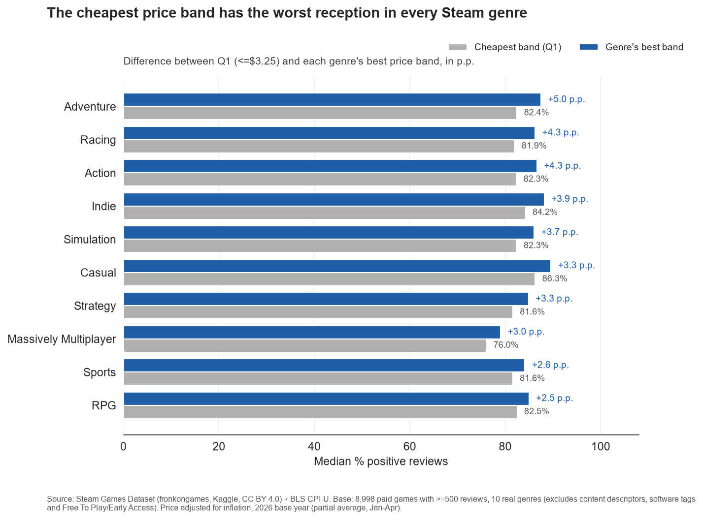
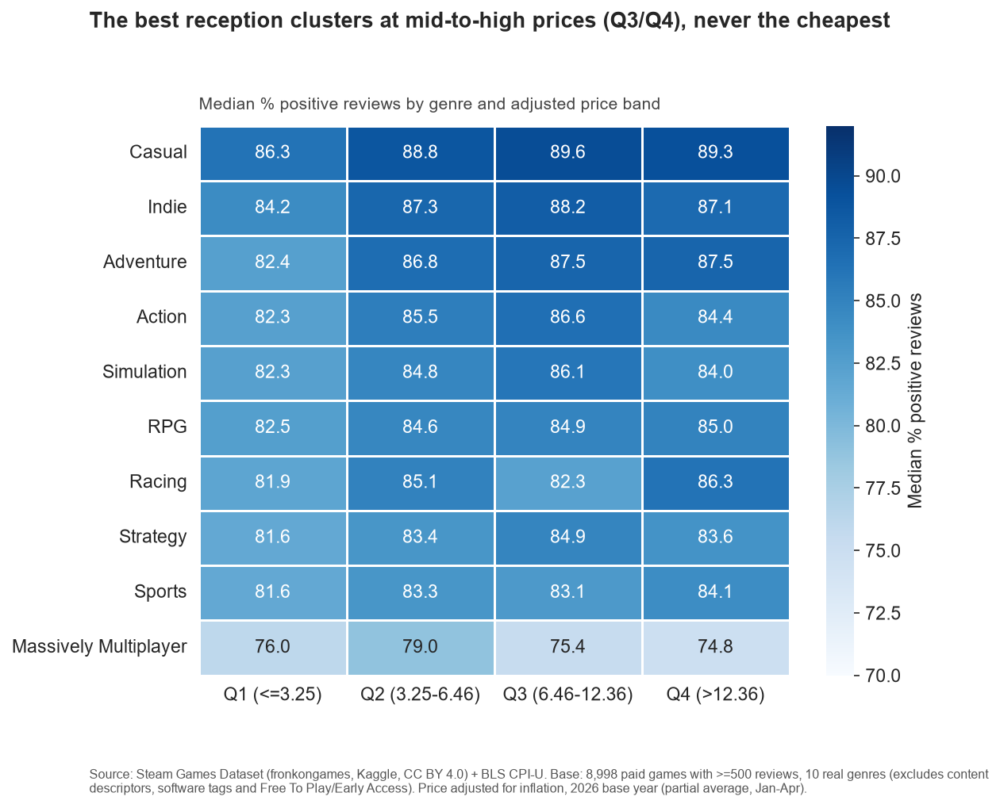
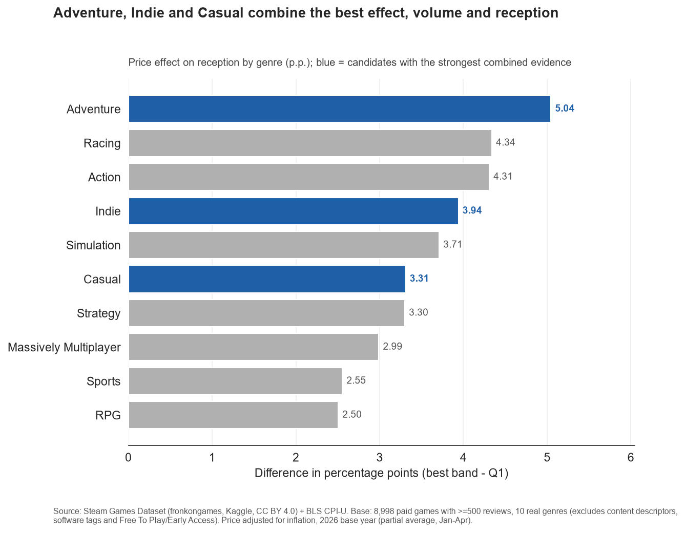
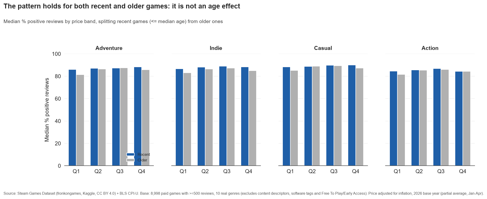

## Context

A video-game-focused investment fund has no data-driven basis for deciding which genre to
prioritise for its thesis in the PC/Steam market. It has more candidates than filters: the
operating question isn't "is this a good game?" but "where in the catalogue is due diligence
time best spent?".

The analytical question I framed: **which genre and price-band combinations (inflation-adjusted
price quartiles, over paid games with ≥500 reviews) in Steam's historical catalogue show the most
consistent pattern of high positive-review share, controlling for game age?** The decision this
unlocks is concrete: recommend 2-3 genres where the committee should prioritise due diligence,
with evidence of which price band sustains the best reception in each.

## Data

| Source | Period | Volume | Licence |
|---|---|---|---|
| [Steam Games Dataset](https://www.kaggle.com/datasets/fronkongames/steam-games-dataset) (fronkongames) | 1997-06-30 → 2026-05 | 125,855 games × 40 columns | CC BY 4.0 |
| [CPI-U, series `CUUR0000SA0`](https://www.bls.gov/cpi/) (US Bureau of Labor Statistics) | 1997-2026 | Annual index | Public domain |

The raw CSV is ~400 MB and is not stored in the case repository — it is downloaded from the
Kaggle link (see Reproduce). CC BY 4.0 requires attribution: fronkongames dataset, Kaggle. No PII
in either source.

**Main limitations:**

- **No causality.** The pattern is a descriptive correlation. The strongest alternative reading —
  that studios charging more also invest more in production — cannot be ruled out with this data.
  What I did rule out with evidence is that it's an age artefact.
- **No revenue or sales data.** `estimated_owners` comes as SteamSpy-estimated ranges, not
  Valve-confirmed figures, and was not used as a metric. This case speaks to reception, not
  profitability.
- **The long tail is excluded.** The ≥500-review filter deliberately excludes 34.1% of the
  catalogue, which has zero reviews. The sample is biased toward visible games.
- **Survivorship bias.** Only games that shipped on Steam. Not cancelled titles, not delisted
  ones, not console or mobile.

## Process

**Tools:** Python with pandas. The file is 400 MB with a structural header bug — auditing it by
hand in a spreadsheet was not viable, and the case required the cleaning to be reproducible end
to end.

**Key cleaning decisions:**

1. **Fixed a header bug.** The raw header declares 39 columns but every row carries 40: the name
   `DiscountDLC count` merges two real columns, `Discount` and `DLC count`. Everything past that
   position was misaligned. Fixed by inserting the missing name before loading.
2. **Inflation adjustment instead of a declared limitation.** I combined the catalogue with the
   BLS CPI-U to compare, in real 2026 dollars, prices of games released 29 years apart. A $9.99
   game from 1999 is not the same product as a $9.99 game from 2025.
3. **Exploded by genre.** A game with N genres produces N rows, so each genre gets its own
   evidence. 117,430 games → 338,575 game-genre rows.
4. **Cleaned the genre taxonomy.** Steam's `Genres` column mixes real genres with content
   descriptors (`Violent`, `Gore`), non-game software tags (`Accounting`, `Utilities`) and
   business model (`Free To Play`, `Early Access`). I excluded the 23 tags that are not a video
   game genre and kept the 10 real ones.

Count reconciliation: 125,855 − 2 (future release date) − 0 (duplicates) − 8,423 (no genre) =
**117,430**, verified with an `assert` in the script. Final analysis base: 9,048 paid games with
≥500 reviews.

## Findings

### 1. The cheapest band has the worst reception in all 10 genres, without exception



The median positive-review share in Q1 (≤$3.25 real) ranges from 76.0% in Massively Multiplayer
to 86.3% in Casual, and across all ten genres it is the lowest or tied for lowest in its genre.
There is not a single genre where the cheapest band gets the best reception.

### 2. The peak sits at mid-to-high prices, not the highest price



In Action, Indie, Simulation, Casual and Strategy the best band is Q3 ($6.46-$12.36); in
Adventure, Racing, Sports and RPG it's Q4 (>$12.36). No genre has its best reception in Q1 or Q2.
This rules out the simplistic "more expensive is always better" reading: in half the genres, the
most expensive band already trails Q3.

### 3. The effect is real but moderate: 2.50 to 5.05 percentage points



The gap between Q1 and each genre's best band ranges from 2.51 p.p. (RPG) to 5.05 p.p.
(Adventure). Quantifying it matters: it supports a directional screening argument, not a claim
that price alone transforms a product's reception. Adventure, Indie and Casual are the three that
combine the best effect, volume (4,030, 5,561 and 2,230 games) and absolute reception (medians of
86.2%, 86.7% and 88.2%).

### 4. Not an age effect: the pattern holds for both new and old games



The obvious objection is that cheap games are simply the old ones. It doesn't hold: the
correlation between age and reception is -0.087 (practically null), and when the table is
repeated splitting recent games from older ones, "Q1 is the worst band" appears in both groups.

### 5. Massively Multiplayer is the exception, and is reported as such

It has no chart of its own, deliberately. It's the only genre with a non-monotonic pattern (its
best band is Q2), has the lowest median of the ten across all four bands (74.8%-79.0%), and the
smallest n in the base (176 games). The evidence is weak, so it is neither recommended nor
dismissed: it is documented as insufficient.

## Recommendations

| # | Recommendation | Evidence | Impact | Effort |
|---|---|---|---|---|
| **R1** | Concentrate next cycle's due diligence on **Adventure, Indie and Casual** | The three highest reception medians (86.2 / 86.7 / 88.2%) + price-band effect of 3.31-5.05 p.p. + sufficient target volume | High | Low |
| **R2** | Add the **catalogue's position in the price quartiles** to screening; flag studios with >50% in Q1 for review | Q1 is the worst band across all 10 genres; the pattern survives the age control | Medium | Low |
| **R3** | **Deprioritise Massively Multiplayer** this cycle; Sports and Racing as "insufficient evidence" | MMO: 76.4% median, non-monotonic pattern, n=176. Sports (329) and Racing (338) below the n<350 threshold | Medium | Low |

All three are low-effort because all three are rules layered on a process the fund already runs.
That's deliberately the ceiling of what this analysis can support: with aggregated reviews and no
revenue data, the honest recommendation is **where to look first**, not where to put the money.

**Main next step:** lower the review threshold to 50 and 100 to see whether the pattern holds in
the indie/niche long tail. That unlocks the decision of whether the fund should open an
investment lane for small studios.

## Reproduce

```bash
# 1. Clone
git clone <REPO-URL>
cd steam-price-reception

# 2. Dependencies
pip install pandas matplotlib seaborn jupyter

# 3. Download the raw file (not in the repo, ~400 MB)
#    https://www.kaggle.com/datasets/fronkongames/steam-games-dataset
#    Save it as:
#    datos/crudos/steam_fronkongames_catalogo-historico_2026-07-28.csv
#    The CPI-U file is already at datos/crudos/bls_cpi-u_anual_1997-2026_2026-07-28.csv

# 4. Run in order
python notebooks/procesar.py    # cleaning -> datos/limpios/
python notebooks/analizar.py    # quartiles and genre x band table -> salidas/tablas/
python notebooks/verificar.py   # the 7 analysis checks
python notebooks/graficos.py    # the 4 figures -> salidas/graficos/
```

## What this demonstrates

Turning an investment question into a pricing-and-sentiment analysis, on a dataset with a real
structural flaw — not trivial nulls, but a broken header that misaligns columns — and combining
it with a second source (CPI-U) to compare prices across 29 years in real dollars.

What I most want to show here is the part that's usually missing: **ruling out the alternative
explanation before publishing the finding**. The obvious objection to "cheap games get worse
reception" is that cheap games are the old ones. I checked, it doesn't hold, and that check is in
the repository with its code. And the genre that didn't fit the conclusion — Massively
Multiplayer — is reported as insufficient evidence instead of being left out.
